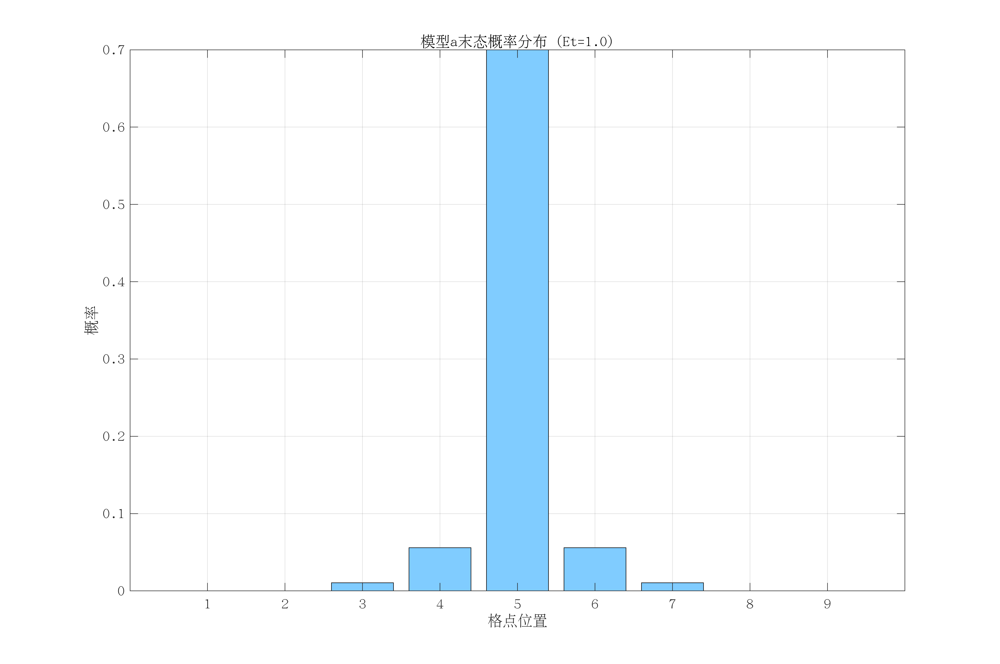
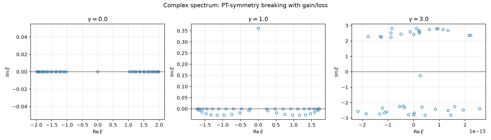
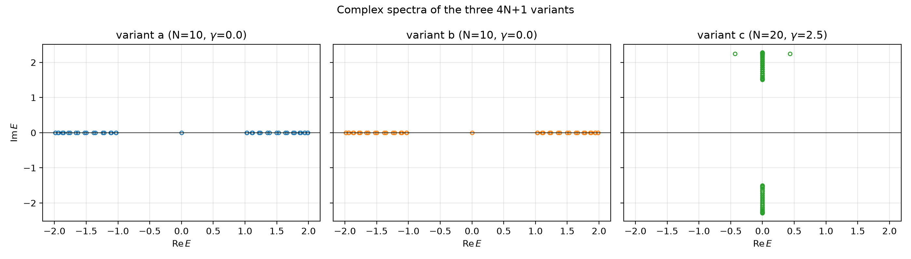

# Non-Hermitian Waveguide Simulation

**Numerical toolbox for non-Hermitian lattice models on the 4N+1-site SSH chain** — eigenvalues in the complex plane, PT-symmetry breaking, time evolution, and inverse participation ratio (IPR) analysis. Written in MATLAB during my M.Sc. at South China Normal University.

> Built while I was writing my first-author review article *Electrical circuit simulation of non-Hermitian lattice models* (Acta Phys. Sin. 72, 200301 (2023)). The simulations here are **my own independent implementation** for understanding the physics behind the review — they do not reproduce the figures of the article itself.

## What's inside

| Module | Files | What it does |
|--------|-------|-------------|
| `matlab/ssh_4nplus1/` | `m_a/b/c_4Nplus1.m`, `OBC.m` | Core: 4N+1-site SSH Hamiltonian with gain/loss (`γ`) and staggered hopping (`J1, J2`); complex-spectrum analysis, time evolution via matrix exponential, IPR dynamics; open-boundary SSH baseline |
| `matlab/coupling/` | `kappa_cal.m`, `单链t+a,t-a循环变t.m` | Coupling-constant calibration and single-chain hopping modulation |
| `matlab/model-compare/` | `Model_cmp_dimensionless.m`, `model_comparision.m` | Dimensionless comparison of the three model variants (final-state distributions, evolution heatmaps) |
| `comsol/` | `MODELS.md` | COMSOL multiphysics models of 1/2/8/9-waveguide arrays (`.mph`, kept out of git) |
| `python/` | NumPy/SciPy port + Jupyter tutorial | Clean-room Python reimplementation with English labels |
| `paper/` | `CITATIONS.md` | Citations: companion review (Xu 2023) + model source (Lang 2018) |

## Physics in two paragraphs

**The cSSH model (model provenance).** The complex SSH (cSSH) chain — an SSH lattice with alternating on-site gain/loss $\pm i\gamma$ — was introduced by **Lang et al., Phys. Rev. B 98, 094307 (2018)** (my M.Sc. advisor L.-J. Lang, with Y. D. Chong's group at NTU). That paper showed that the topological SSH mid-gap defect state, localized at the interface between two cSSH domains, behaves anomalously under strong non-Hermiticity: it can *disappear into the complex continuum*, or undergo a spontaneous composite sublattice/time-reversal (ST) symmetry breaking at an exceptional point, producing a *pair* of defect states continuable to the non-topological SSH defect states. The 4N+1-site chains in this repository are numerical realizations of that two-domain geometry — two SSH/cSSH halves joined at a central defect site $b_N$ — with the three variants `a`/`b`/`c` corresponding to different gain/loss phase patterns (same-phase PT, anti-phase PT, anti-phase with $b_N$ gaining).

**Why circuit simulation (the review).** The optics–quantum analogy maps paraxial light propagation in waveguide arrays onto the Schrödinger equation, making photonic lattices classical emulators of tight-binding models. Classical **circuits** are a particularly flexible emulator — they can implement arbitrary hoppings and on-site terms, including the non-reciprocal couplings and gain/loss required for non-Hermitian models. I surveyed this field in my first-author review, *Electrical circuit simulation of non-Hermitian lattice models* (Acta Phys. Sin. 72, 200301 (2023)), covering circuit–lattice mapping theory and experimental progress on PT symmetry, skin effect, and non-Hermitian topology. This repository's simulations were built while writing that review, as a hands-on bridge between my advisor's theory (Lang 2018) and the experimental landscape the review describes.

## Run it

Requires MATLAB (or GNU Octave, which runs the pure-numerical parts without modification).

```bash
# Spectrum, time evolution, IPR — model a
octave matlab/ssh_4nplus1/m_a_4Nplus1.m

# Open-boundary SSH baseline
octave matlab/ssh_4nplus1/OBC.m

# Compare model variants (dimensionless)
octave matlab/model-compare/Model_cmp_dimensionless.m
```

Each script self-contained (Hamiltonian construction and solvers are local functions inside the file).

**Python port** (NumPy/SciPy, English labels, Jupyter tutorial): see [`python/`](python/README.md).

## Sample results

| | |
|---|---|
| **Model a — final-state probability** (N=10, γ=0, J1=0.5, J2=1.5): probability localizes at the central lattice site (0.70), characteristic of the bound state in the 4N+1 geometry |  |
| **Model comparison** — final-state distributions of variants a/b/c side by side |  |

### Python port figures (English labels)

The NumPy port adds a PT-breaking scan and variant comparison (see [`python/`](python/README.md)):

| | |
|---|---|
| **PT-symmetry breaking** — complex spectrum as gain/loss γ grows: eigenvalues leave the real axis |  |
| **Variant comparison** — complex spectra of a/b/c at γ=2.5 |  |

A **deep-dive notebook** reproduces the Lang et al. (2018) physics — the mid-gap defect state pinned to zero real energy that acquires an imaginary part, its localization-length divergence (disappearance into the continuum), non-unitary amplification, and a contrast between skin effect (non-reciprocal hoppings) and gain/loss: [`python/tutorial_defect_states.ipynb`](python/tutorial_defect_states.ipynb).

## Why this matters for my research direction

This project sits at the intersection of **wave physics + numerical modeling + machine learning**: (1) non-Hermitian/photonic systems are my M.Sc. core; (2) the toolbox demonstrates hands-on Hamiltonian-level simulation; (3) the natural next step is learning the dynamics *data-driven* — see [my Neural ODE project](https://github.com/sj-nosugar/neutral-ode-double-pendulum) (chaotic double pendulum, physics→data→NODE→MPC) and the planned extension: *Neural ODE for non-Hermitian waveguide dynamics*.

## Citation

If you use this repository or its code in your research, please cite:

- **L.-J. Lang, Y. Wang, H. Wang, Y. D. Chong**, *Effects of non-Hermiticity on Su-Schrieffer-Heeger defect states*, Phys. Rev. B 98, 094307 (2018) — the cSSH model this toolbox implements
- **C. Xu et al.**, *Electrical circuit simulation of non-Hermitian lattice models*, Acta Phys. Sin. 72, 200301 (2023) — companion review (first author)

BibTeX in [`paper/CITATIONS.md`](paper/CITATIONS.md). This repository is part of the author's ongoing research; the numerical work here is an independent implementation for studying the published physics above.

## License

MIT — see [LICENSE](LICENSE).
